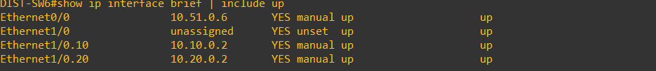
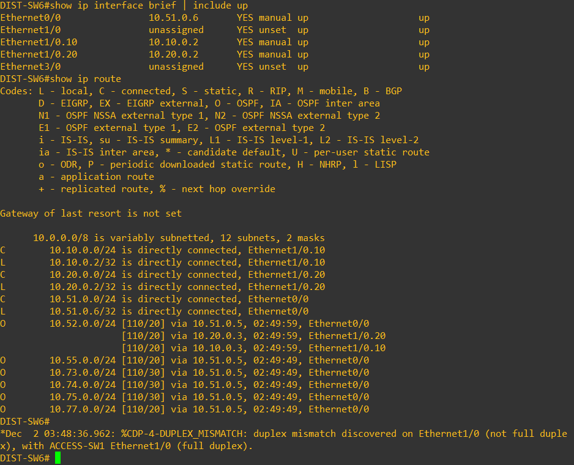
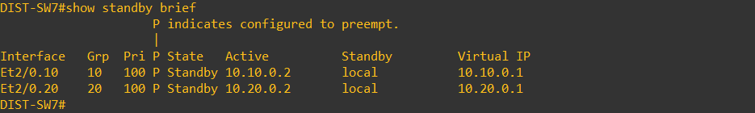

# Evidence — Final Integrated Network

Esta página contém imagens de evidência recolhidas durante a validação do laboratório integrado (OSPF, HSRP, DHCP, trunking, port‑security e testes de conectividade).

Coloque aqui as imagens sob a pasta `06-Final-Integrated-Network/evidence/` com nomes:

- `evidence-ospf-neighbors.png` — saída de `show ip ospf neighbor`
- `evidence-ip-route-R5.png` — `show ip route` (R5)
- `evidence-hsrp-dist-sw6.png` — `show standby` (DIST‑SW6)
- `evidence-dhcp-bindings-R5.png` — `show ip dhcp binding` (R5)
- `evidence-trunks-portchannel.png` — `show interfaces trunk` / `show etherchannel summary`
- `evidence-port-security.png` — `show port-security interface <if>`
- `evidence-ping-vlan10-to-73.png` — teste de conectividade entre VLANs em sites diferentes

---

## Imagens

