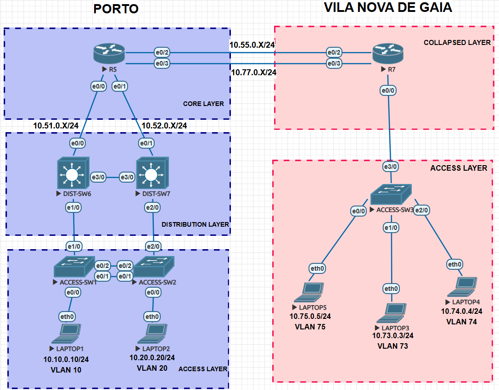

# Enterprise Switching & Redundancy Project

## Introdução
Este repositório contém uma arquitetura completa de switching empresarial e redundância, concebida para interligar dois locais corporativos — Porto e Vila Nova de Gaia — com práticas de engenharia de rede resistentes, escaláveis e seguras. O desenho privilegia elevada disponibilidade, comportamento previsível da malha de campus e separação de tráfego por função, permitindo suportar serviços críticos de negócio e segmentação por departamentos ou clientes. Destina‑se a engenheiros de rede, arquitetos e equipas de operações como um guia prático e adaptável para implementação de campus resilientes e conectividade entre sites.

## Objetivo do Projeto
Os objetivos principais deste projeto são:

- Redundância: Garantir resiliência na infraestrutura de switching e gateways, com failover rápido para minimizar interrupções e cumprir os objetivos de disponibilidade empresariais.
- Segmentação VLAN: Aplicar separação de tráfego através de VLANs para isolar grupos de utilizadores, serviços e planos de gestão, reforçando a segurança e a operacionalidade.
- Switching de campus: Implementar uma malha de switching multilayer robusta, com comportamento STP previsível, agregação de ligações e separação clara entre camadas de acesso e agregação.
- Roteamento entre sites: Assegurar roteamento dinâmico e escalável entre Porto e Vila Nova de Gaia, com políticas claras de alcance e planeamento de rotas.
- Serviços essenciais: Documentar e demonstrar a configuração de serviços essenciais (por exemplo DHCP, HSRP para gateway redundante, Router‑on‑a‑Stick para inter‑VLAN routing, DHCP Relay quando aplicável) e medidas básicas de hardening dos equipamentos (SSH, AAA, gestão).

## Tecnologias-chave Implementadas
- VLANs
- Rapid‑PVST
- EtherChannel (Port‑Channel)
- Port Security
- Router‑on‑a‑Stick
- DHCP + DHCP Relay
- HSRP
- OSPF
- Configuração básica de dispositivos (SSH, hostname, banners, NTP, logging)

## Topologia



> Figura: Topologia lógica Porto ↔ Vila Nova de Gaia (ficheiro `topology.png`).

# Enterprise Switching & Redundância

## Introdução

Este repositório contém a arquitetura do laboratório de switching e redundância para os sites Porto e Vila Nova de Gaia. Inclui configurações de exemplo, verificações e um laboratório integrado para validar VLANs, HSRP, DHCP, Router‑on‑a‑Stick, EtherChannel e OSPF.

## Objetivos

- Garantir redundância e failover rápido nos gateways e na malha de switching.
- Segmentar tráfego via VLANs e SVIs para isolar serviços e utilizadores.
- Implementar agregação de enlaces (EtherChannel) e políticas de segurança de porta.
- Fornecer roteamento dinâmico entre sites com OSPF.
- Demonstrar serviços essenciais: DHCP, DHCP Relay, HSRP e Router‑on‑a‑Stick.

## Tecnologias-chave

- VLANs
- Rapid‑PVST
- EtherChannel (Port‑Channel)
- Port Security
- Router‑on‑a‑Stick
- DHCP + DHCP Relay
- HSRP
- OSPF

## Visão Geral

Dois sites (Porto e Gaia) interligados por enlaces L3. Cada site tem camadas de acesso e agregação; gateways redundantes por VLAN são implementados com HSRP e o encaminhamento inter‑site é tratado por OSPF.

## Estrutura do Repositório

- `00-Basic-Device-Setup/` — Configuração base de dispositivos.
- `01-Switching-Foundation-VLANs-STP/` — Projeto de VLANs e STP.
- `02-Uplinks-PortChannel-and-PortSecurity/` — EtherChannel e Port Security.
- `03-Router-on-a-Stick-InterVLAN-Routing/` — Subinterfaces e inter‑VLAN routing.
- `04-Redundant-Gateway-HSRP-and-DHCP/` — HSRP e DHCP/Relay.
- `05-OSPF-InterSite-Routing-Porto-Gaia/` — Exemplos OSPF.
- `06-Final-Integrated-Network/` — Configurações finais integradas e ficheiros de evidência.

## Início Rápido

1. Rever `00-Basic-Device-Setup/` para aplicar configurações base.
2. Aplicar configurações de `06-Final-Integrated-Network/` em ambiente de laboratório por etapas: cores → distribution → access.
3. Validar OSPF, HSRP, DHCP e trunking entre cada etapa.

Comandos úteis de verificação:

```
show ip interface brief
show running-config | section interface
show ip route
show ip ospf neighbor
show standby
show ip dhcp binding
show etherchannel summary
show interfaces trunk
show port-security interface <if>
show mac address-table
```

## Contribuições

Contribuições são bem‑vindas. Ao submeter alterações, inclua passos de teste e justificações técnicas.

## Licença

Este projeto está licenciado sob a MIT License — consulte o ficheiro `LICENSE` na raiz do repositório para os termos completos.

---

*Ficheiro principal do projecto — documentação e visão geral (Português).* 
