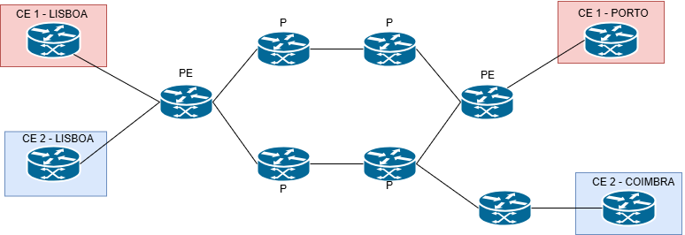

# MPLS L3 VPN - Network Simulation Project

[](https://www.gns3.com/)
[](https://www.cisco.com/)
[](https://en.wikipedia.org/wiki/MPLS_VPN)

This project is part of the **Advanced Topics in Networking** course and focuses on configuring and testing an **MPLS (Multiprotocol Label Switching)** network with **Layer 3 VPN** support.

## 📋 Project Overview

MPLS technology is a solution offered by Internet Service Providers (ISPs) to companies with geographically dispersed networks. The appeal of MPLS lies in its use of **labels for packet forwarding**, as well as its support for services such as:

- **VPN (Virtual Private Network)**
- **Traffic Engineering**
- **Quality of Service (QoS)**

When applied in conjunction with **Layer 3 VPN (L3 VPN)**, MPLS ensures customer security by creating **isolated routes** for each client using **VRF (Virtual Routing and Forwarding)**.

## 🏗️ Network Topology



### Scenario Description

The topology simulates an ISP's MPLS infrastructure connecting two different customers:

| Customer | Branch 1 | Branch 2 | VRF Name |
|----------|----------|----------|----------|
| **CE1 (Amazon)** | Lisboa | Porto | AMAZON |
| **CE2 (Microsoft)** | Lisboa | Coimbra | MICROSOFT |

**Key Points:**
- Both Lisboa networks connect to the **same PE router (PE1)**, requiring traffic isolation between customers
- CE1-Porto and CE2-Coimbra connect to different PEs (PE2 and PE3)
- Point-to-point traffic traverses at least **4 MPLS routers**

## 🖧 Network Devices

### Router Roles

| Device | Role | Description | Loopback IP |
|--------|------|-------------|-------------|
| **PE1** | Provider Edge | Connects Lisboa customers (CE1 & CE2) | 10.10.10.10 |
| **PE2** | Provider Edge | Connects CE1-Porto | 2.2.2.2 |
| **PE3** | Provider Edge | Connects CE2-Coimbra | 3.3.3.3 |
| **P1** | Provider | Core MPLS router | 1.1.1.1 |
| **P2** | Provider | Core MPLS router | 4.4.4.4 |
| **P3** | Provider | Core MPLS router | 5.5.5.5 |
| **P4** | Provider | Core MPLS router | 6.6.6.6 |
| **CE1-Lisboa** | Customer Edge | Amazon Lisboa branch | 192.168.0.1 |
| **CE1-Porto** | Customer Edge | Amazon Porto branch | 192.168.1.1 |
| **CE2-Lisboa** | Customer Edge | Microsoft Lisboa branch | 172.16.0.1 |
| **CE2-Coimbra** | Customer Edge | Microsoft Coimbra branch | 172.16.1.1 |

## ⚙️ Technologies & Protocols Used

### MPLS Configuration
```
mpls label protocol ldp
mpls ldp router-id Loopback0 force
```

### VRF Configuration (PE Routers)
```
ip vrf AMAZON
 rd 10003:20
 route-target export 10003:100
 route-target import 10003:100

ip vrf MICROSOFT
 rd 10002:10
 route-target export 10002:100
 route-target import 10002:100
```

### Routing Protocols
- **OSPF** (Area 0) - IGP for MPLS backbone
- **MP-BGP** - For VPNv4 route exchange between PEs
- **LDP** - Label Distribution Protocol

## 📁 Project Structure

```
mpls_l3_vpn/
├── README.md                           # This file
├── arquitetura.png                     # Network topology diagram
├── demo_mpls_l3_vpn.gns3project       # GNS3 project file
├── configs/                            # Router configurations
│   ├── CE1-LISBOA_configs_*.cfg       # Amazon Lisboa
│   ├── CE1-PORTO_configs_*.cfg        # Amazon Porto
│   ├── CE2-COIMBRA_configs_*.cfg      # Microsoft Coimbra
│   ├── CE2-LISBOA_configs_*.cfg       # Microsoft Lisboa
│   ├── P1_configs_*.cfg               # Provider router 1
│   ├── P2_configs_*.cfg               # Provider router 2
│   ├── P3_configs_*.cfg               # Provider router 3
│   ├── P4_configs_*.cfg               # Provider router 4
│   ├── PE1_configs_*.cfg              # Provider Edge 1 (Lisboa)
│   ├── PE2_configs_*.cfg              # Provider Edge 2 (Porto)
│   └── PE3_configs_*.cfg              # Provider Edge 3 (Coimbra)
└── report/                             # Project documentation
```

## 🚀 How to Run

### Prerequisites
- [GNS3](https://www.gns3.com/software/download) installed
- Cisco IOS image (c7200 or similar with MPLS support)
- [Wireshark](https://www.wireshark.org/) for traffic analysis

### Steps
1. Open GNS3 and import the project file `demo_mpls_l3_vpn.gns3project`
2. Start all routers
3. Wait for OSPF and LDP adjacencies to form
4. Test connectivity between customer sites

## 🧪 Verification Commands

### Check MPLS Labels
```
show mpls forwarding-table
show mpls ldp neighbor
show mpls ldp bindings
```

### Check VRF Routing
```
show ip vrf
show ip route vrf AMAZON
show ip route vrf MICROSOFT
show ip bgp vpnv4 all
```

### Check BGP VPNv4
```
show bgp vpnv4 unicast all summary
show bgp vpnv4 unicast all
```

### Test Connectivity
```
! From CE1-Lisboa to CE1-Porto
ping 192.168.1.1 source 192.168.0.1

! From CE2-Lisboa to CE2-Coimbra
ping 172.16.1.1 source 172.16.0.1
```

## 📊 Traffic Analysis

Using **Wireshark**, capture traffic on MPLS links to observe:
- Label stacking (VPN label + Transport label)
- LDP message exchange
- BGP UPDATE messages with VPNv4 prefixes
- Label Switched Path (LSP) formation

## 🎯 Project Objectives

1. **Configure** an MPLS network with L3 VPN support
2. **Test** connectivity between geographically dispersed customer sites
3. **Analyze** MPLS label operations and VRF isolation
4. **Study** LDP and MP-BGP message exchange
5. **Observe** Label Switched Path (LSP) construction

## 📚 Key Concepts

| Concept | Description |
|---------|-------------|
| **MPLS** | Multiprotocol Label Switching - forwards packets using labels |
| **LDP** | Label Distribution Protocol - distributes labels between routers |
| **VRF** | Virtual Routing and Forwarding - creates isolated routing tables |
| **RD** | Route Distinguisher - makes VPNv4 prefixes unique |
| **RT** | Route Target - controls route import/export between VRFs |
| **PE** | Provider Edge - connects customers to MPLS network |
| **P** | Provider - core MPLS router (label switching only) |
| **CE** | Customer Edge - customer's router |

## 👨‍💻 Author

Project developed for **Advanced Topics in Networking** course.

## 📄 License

This project is for educational purposes only.
